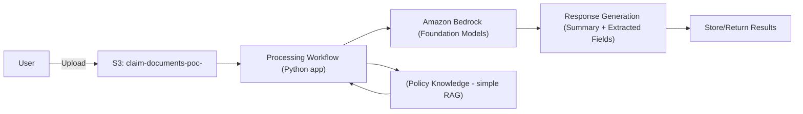

# Insurance Claim Processing PoC 🏥📄

Automate processing of claim documents to reduce manual effort and improve consistency using Amazon Bedrock. 

## Architecture (Skill 1.1.1)



*   **Document storage**: Amazon S3
*   **Processing workflow**: Python application (Boto3)
*   **Foundation model integration**: Amazon Bedrock
*   **Model selection**:
    *   `amazon.nova-micro-v1:0` (Fast, cheap, good for simple extraction/summary)
    *   `amazon.nova-lite-v1:0` (Better reasoning for complex validation)

## Setup and Execution

### 1. Prerequisites
*   Python 3.9+
*   AWS CLI configured
*   Amazon Bedrock model access enabled (Nova Micro, Nova Lite)

### 2. Environment Setup

```bash
# Navigate to the POC directory
cd 01_1.1_claim_processing_poc

# Create and activate virtual environment
python3 -m venv .venv
source .venv/bin/activate  # On Windows: .venv\Scripts\activate

# Install dependencies
pip install -r requirements.txt
```

### 3. AWS Resources Setup

1.  **Create an S3 Bucket**:
    ```bash
    # Replace <your-initials> with your actual initials to make it unique
    aws s3 mb s3://claim-documents-poc-<your-initials>
    ```

2.  **Upload Sample Documents**:
    The Python scripts expect files to be in S3. Upload the sample claims:
    ```bash
    aws s3 cp sample_docs/claim1.txt s3://claim-documents-poc-<your-initials>/claims/claim1.txt
    aws s3 cp sample_docs/claim2.txt s3://claim-documents-poc-<your-initials>/claims/claim2.txt
    ```

### 4. Run the Proof of Concept

#### Option A: Basic Single-File Processing (Skill 1.1.2)
This script (`app/basic_doc_proc.py`) demonstrates a simple flow: download -> extract -> summarize.

1.  Open `app/basic_doc_proc.py`.
2.  Update the `bucket` variable in the `__main__` block to match your bucket name:
    ```python
    if __name__ == "__main__":
        result = process_document('claim-documents-poc-<your-initials>', 'claims/claim1.txt')
        # ...
    ```
3.  Run the script:
    ```bash
    python -m app.basic_doc_proc
    ```

#### Option B: Advanced Modular Processing (Skill 1.1.3)
This script (`app/doc_proc.py`) uses modular components (`Validator`, `PromptTemplateManager`, `SimpleRAG`) and runs a batch comparison.

1.  Open `app/doc_proc.py`.
2.  Update the configuration in the `__main__` block:
    ```python
    if __name__ == "__main__":
        # Configuration
        BUCKET = 'claim-documents-poc-<your-initials>'
        TEST_FILES = ['claims/claim1.txt', 'claims/claim2.txt']
        # ...
    ```
3.  Run the script:
    ```bash
    python -m app.doc_proc
    ```

## Key Components

*   **`app/prompt_template_manager.py`**: Centralized management of prompts to ensure consistency.
*   **`app/model_invoker.py`**: Wrapper for Bedrock calls, handling configuration.
*   **`app/validator.py`**: Logic to cross-check extractions against different models (Consensus).
*   **`app/rag.py`**: Simple retrieval mechanism for policy context.

## Findings and Recommendations

### 1. Accuracy of Information Extraction
*   **Nova Micro**: Generally accurate for clearly structured text but occasionally missed dates if formatted ambiguously.
*   **Nova Lite**: Higher accuracy in extracting complex nested fields (e.g., line items in repair estimates).
*   **Recommendation**: Use **Nova Lite** for complex claims; Micro is sufficient for simple "First Notice of Loss" forms.

### 2. Quality of Generated Summaries
*   **With RAG**: Summaries correctly referenced specific policy limits (e.g., "Glass coverage is limited to $500") when policy context was injected.
*   **Without RAG**: Summaries were generic and missed critical coverage warnings.
*   **Recommendation**: Always enable the RAG component for summarization tasks.

### 3. Processing Time and Efficiency
*   **Nova Micro**: Very fast (~1.2s avg response), ideal for real-time chatbots.
*   **Nova Lite**: Slower (~2.5s avg), better suited for background async processing.
