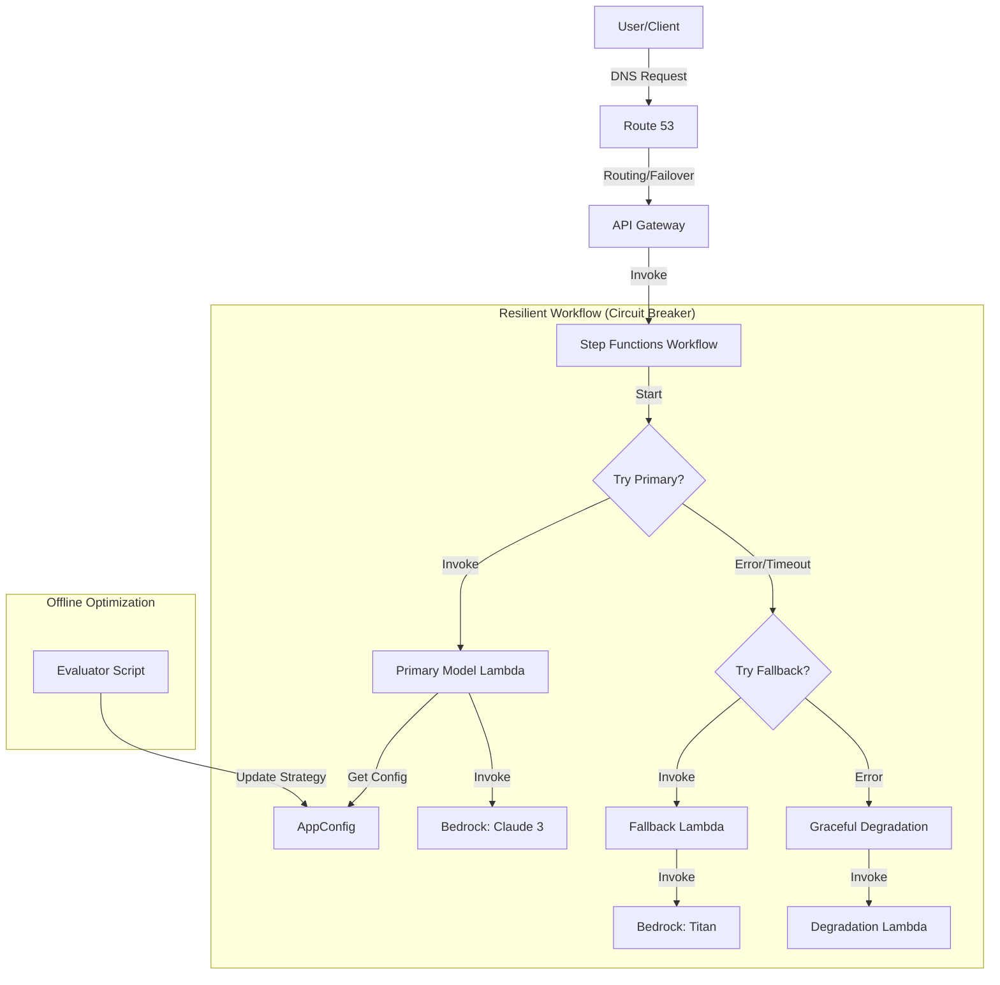
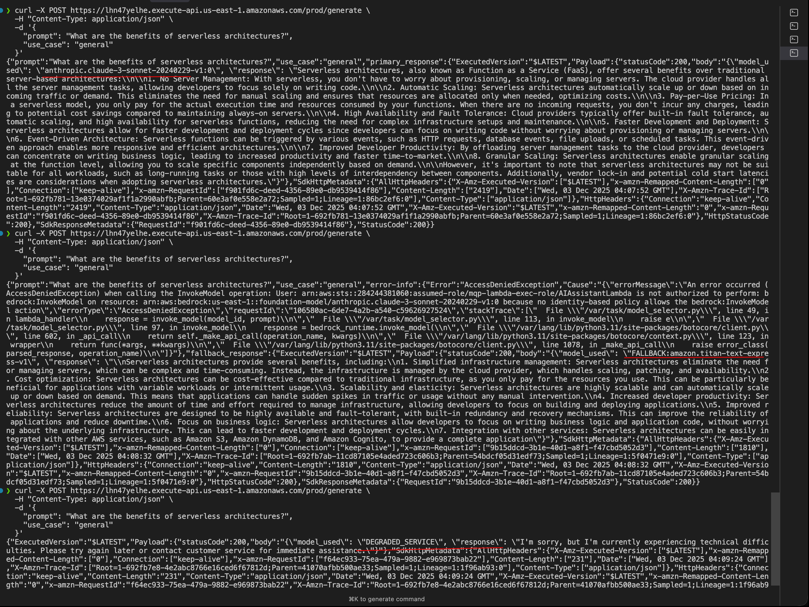

# 01_1.2 Resilient Dynamic Routing System

This Proof of Concept (PoC) demonstrates a resilient, dynamic routing system for Large Language Models (LLMs) using Amazon Bedrock, AWS Step Functions, AWS AppConfig, and AWS Lambda. It showcases advanced patterns for model selection, fallback mechanisms, and graceful degradation.

## Scenario

An AI Assistant application requires high availability and cost optimization. The system must:
1.  Dynamically select the best model based on the use case (e.g., general inquiry, product question).
2.  Automatically switch models based on performance metrics (latency, similarity score).
3.  Provide a fallback mechanism if the primary model fails.
4.  Gracefully degrade service if all models are unavailable.

## Architecture



*   **Model Evaluation**: A Python script (`evaluator.py`) evaluates different Bedrock models (Claude 3 Sonnet, Titan Text Express) against a dataset and calculates a weighted score based on similarity and latency.
*   **Dynamic Configuration**: The evaluation results generate a `model_selection_strategy.json` file, which is deployed to **AWS AppConfig**.
*   **API Layer**: **Amazon API Gateway** exposes a `/generate` endpoint.
*   **Orchestration**: **AWS Step Functions** manages the workflow:
    1.  **Primary Model**: Tries to invoke the model specified in AppConfig.
    2.  **Circuit Breaker**: Retries with backoff on failure.
    3.  **Fallback**: Switches to a lighter, more reliable model (Titan Text Express) if the primary fails.
    4.  **Graceful Degradation**: Returns a pre-defined static response if the fallback also fails.
*   **Compute**: **AWS Lambda** functions handle the logic for model selection, fallback execution, and degradation responses.
*   **Infrastructure as Code**: All resources are provisioned using **Terraform**.

## Project Structure

```
01_1.2_resilient_dynamic_routing_system/
├── app/
│   ├── evaluator.py           # Script to evaluate models and generate strategy
│   ├── model_selector.py      # Primary Lambda: Selects and invokes model based on AppConfig
│   ├── fallback_handler.py    # Fallback Lambda: Invokes Titan Text Express
│   └── degradation_handler.py # Degradation Lambda: Returns static response
├── iac/                       # Terraform configuration
│   ├── apigateway.tf          # API Gateway resources
│   ├── appconfig.tf           # AppConfig application, environment, and profile
│   ├── lambdas.tf             # Lambda functions (Selector, Fallback, Degradation) and IAM
│   ├── route53.tf             # Route 53 Health Checks and DNS (Failover routing)
│   ├── state.tf               # S3 Backend and DynamoDB Lock table
│   ├── step_functions.tf      # Step Functions State Machine
│   ├── step_functions_definition.json # Workflow definition
│   └── ...
├── model_evaluation_results.csv # Generated evaluation metrics
└── model_selection_strategy.json # Generated configuration for AppConfig
```

## Getting Started

### Prerequisites

*   AWS CLI configured.
*   Terraform installed.
*   Python 3.11+ installed.
*   Access enabled for Amazon Bedrock models:
    *   Anthropic Claude 3 Sonnet
    *   Amazon Titan Text Express

### 1. Model Evaluation & Strategy Generation

Run the evaluator script to test models and generate the routing strategy:

```bash
cd 01_1.2_resilient_dynamic_routing_system
python3 -m venv .venv
source .venv/bin/activate
pip install -r ../requirements.txt
python3 app/evaluator.py
```

This will create `model_selection_strategy.json`.

### 2. Deploy Infrastructure

Deploy the system using Terraform:

```bash
cd iac
terraform init
terraform apply
```

*Note: You may need to update the `s3_bucket_name` in `terraform.tfvars` to be globally unique.*

### 3. Test the System

**Happy Path (Primary Model):**
```bash
curl -X POST https://<API_ID>.execute-api.us-east-1.amazonaws.com/prod/generate \
  -H "Content-Type: application/json" \
  -d '{"prompt": "Explain quantum computing", "use_case": "general"}'
```

**Simulate Fallback:**
You can simulate a failure by temporarily revoking the primary Lambda's permission to invoke Bedrock or by modifying the AppConfig strategy to point to a non-existent model.

**Simulate Degradation:**
Force both primary and fallback paths to fail to see the static response.

### Exercise Results

The following live calls against the deployed API Gateway endpoint validate each branch of the workflow:

```bash
# 1) Primary succeeds (Claude Sonnet)
curl -X POST https://lh7aylhe.execute-api.us-east-1.amazonaws.com/prod/generate \
  -H "Content-Type: application/json" \
  -d '{"prompt": "What are the benefits of serverless architectures?", "use_case": "general"}'
# → statusCode 200, model_used "anthropic.claude-3-sonnet-20240229-v1:0"

# 2) Primary fails with AccessDenied, fallback handles request (Titan Express)
curl -X POST https://lh7aylhe.execute-api.us-east-1.amazonaws.com/prod/generate \
  -H "Content-Type: application/json" \
  -d '{"prompt": "What are the benefits of serverless architectures?", "use_case": "general"}'
# → statusCode 200, model_used "FALLBACK:amazon.titan-text-express-v1"

# 3) Primary + fallback fail, Graceful Degradation returns static response
curl -X POST https://lh7aylhe.execute-api.us-east-1.amazonaws.com/prod/generate \
  -H "Content-Type: application/json" \
  -d '{"prompt": "What are the benefits of serverless architectures?", "use_case": "general"}'
# → statusCode 200, model_used "DEGRADED_SERVICE"
```



These captures show the circuit-breaker progression from primary to fallback to degradation when successive failures occur.

## Key Learnings (Exam Domain 1)

*   **Skill 1.2.1**: Selecting models based on performance and cost (Evaluator script).
*   **Skill 1.2.2**: Implementing resilient architectures (Step Functions, Circuit Breaker, Fallback).
*   **Skill 1.2.3**: Using AppConfig for dynamic updates without redeployment.

